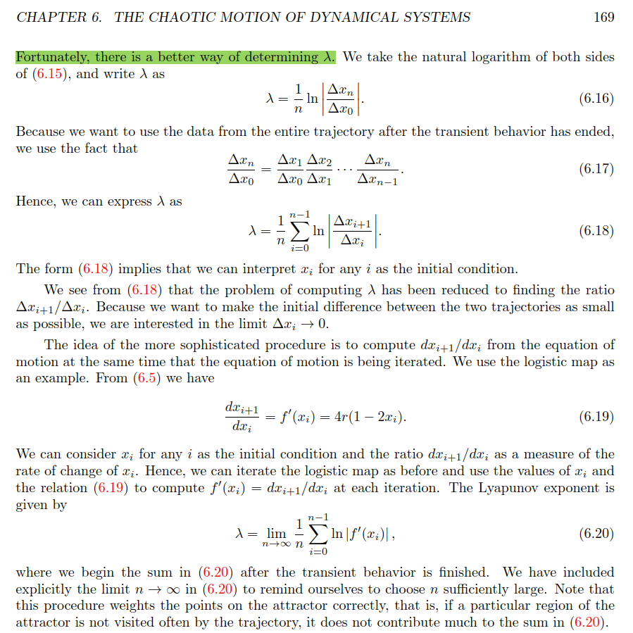
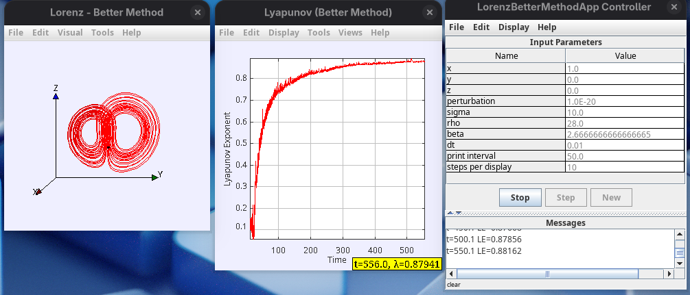

# Objective
Implementing an algorithm to detrmine the Lyapunov exponent using the equations 6.16, 6.17, 6.18, and 6.20 in Chapter 6 "The Chaotic Motion of Dynamical Systems".

# Screenshot of the equations

# Method
This experiment uses only one set of the Lorenz equations to determine the Lyapunov exponent (LE). This is in contrasts with the "naive method" previously developed using Open Source Physics. The code and running demo pertaining to the "naive method" can be found in https://github.com/AlfonsoRReyes/lorenz-lyapunov

The results of the "naive method" match theoretical results found in papers. For small values up to 1e-14, the Lyapunov exponent tends to converge near 0.9056; value found in other literature. For values equal or smaller than 1e-15, the algorithm will fail and LE will drop to near zero. This is attibuted to the physical limitation of the computer when dealing with float numbers.

# Discovery
When discretizing the method in page 17 of chapter 6 (page 169 of the book), we find some perplexing results. The link to the chpater can be downloaded from https://www.compadre.org/osp/items/detail.cfm?ID=9921.

We will refer to the method in page 17 (169) as the "better method". When the "better method" is implemented and running coverges nicely to values very close to 0.9056. We have tested the algorithm at a perturabation in a variable of state at 1e-9, 1e-12, 1e-14, etc.

When we tried smaller perturbations such 1e-15, 1e-16, 1e-17, and even 1e-20, the Lyapunov exponent still is trying to converge towards 0.9. The algorithm should fail at these values, but it doesn't. It continues to converge.

This is a screenshot of the algorithm trying to converge to 0.9 at a perturbation value of 1e-20.

